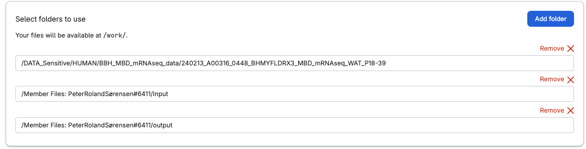
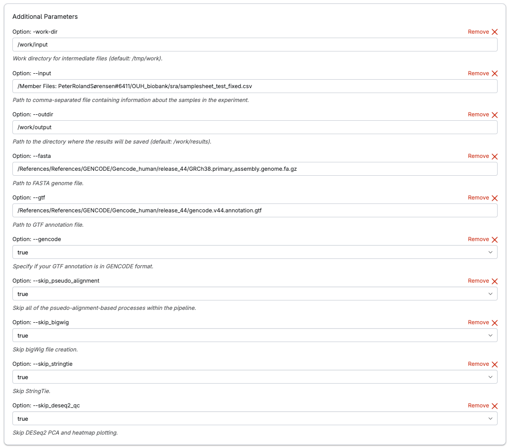

# Pipeline for bulk RNA-seq in UCloud using NF-CORE

# Overview
Nf-core is a community effort to collect a curated set of analysis pipelines built using Nextflow. In regards to RNA sequencing, the nf-core/rnaseq (https://nf-co.re/rnaseq/3.14.0/) can be used to analyse RNA sequencing data obtained from organisms with a reference genome and annotation. It takes a sample sheet and FASTQ files as input, performs quality control (QC), trimming and (pseudo-)alignment, and produces a gene expression matrix and extensive QC report. The pipeline is fully integrated into UCloud, and can be accessed through the application section search: “NF core: rnaseq” (https://cloud.sdu.dk/app/jobs/create?app=nf-core-rnaseq). 

# Before setting up job 
**Create sample sheet**: Sample sheet should be a .csv (comma-separated(,)) file containing the columns: “sample”,”fastq_1”,”fastq_2”,”strandedness”. Each row represents a pair of fastq files (paired end). *Rows with the same sample identifier are considered technical replicates and merged automatically*. The strandedness refers to the library preparation and will be automatically inferred if set to auto.

## Example

<table>
  <tr>
    <th style="color:red;">sample</th>
    <th style="color:lightgreen;">fastq_1</th>
    <th style="color:blue;">fastq_2</th>
    <th style="color:orange;">strandedness</th>
  </tr>
  <tr>
    <td style="color:red;">CONTROL1</td>
    <td style="color:lightgreen;">./demultiplexed/AEG588A1_S1_L002_R1_001.fastq.gz</td>
    <td style="color:blue;">./demultiplexed/AEG588A1_S1_L002_R2_001.fastq.gz</td>
    <td style="color:orange;">auto</td>
  </tr>
  <tr>
    <td style="color:red;">TREATMENT1</td>
    <td style="color:lightgreen;">./demultiplexed/AEG588A2_S1_L002_R1_001.fastq.gz</td>
    <td style="color:blue;">./demultiplexed/AEG588A2_S1_L002_R2_001.fastq.gz</td>
    <td style="color:orange;">auto</td>
  </tr>
</table>
 

A .csv example can be found here: [Example_samplesheet](files/Example_samplesheet.csv)

# Setting up job

## Select folders to use

**Folder containing Fastq files** – example: /NGS_Runs_Data/runs_Adiposign/ 240213_A00316_0448_BHMYFLDRX3_MBD_mRNAseq_WAT_P18-39) 

**Folder for Input** – example:  /Member Files: PeterRolandSørensen#6411/Input

**Folder for output** – example:    /Member Files: PeterRolandSørensen#6411/output

## Example of folders to use

## Additional Parameters 

**Option: --input**: Path to sample sheet – example: /Member Files: PeterRolandSørensen#6411/sample_sheet/samplesheet_RNAseq_experiment.csv

**Option: --outdir**: /work/output 

**Option: --work-dir**: /work/Input 

**Option: --fasta**: Path to fasta file (located in /FGM/)

-	**Human**:/References/References/GENCODE/Gencode_human/release_44/GRCh38.primary_assembly.genome.fa.gz

-	**Mouse**:/References/References/GENCODE/Gencode_mouse/release_M33/GRCm39.primary_assembly.genome.fa.gz

**Option: --gtf**: Path to gtf file (located in /FGM/):

-	**Human**:/References/References/GENCODE/Gencode_human/release_44/gencode.v44.annotation.gtf
-	**Mouse**:/References/References/GENCODE/Gencode_mouse/release_M33/gencode.vM33.annotation.gtf

**Option: --gencode**: True 

**Option: --aligner**: star_salmon

**Option: --skip_pseudo_alignment**: True 

**Option: --skip_deseq2_qc**: True 

**Option: --skip_stringtie**: True (set to False if studying splicing/isoforms) 

**Option: --skip_bigwig**: True (set to False if interested in coverage tracks an alignment) 
**Option: --save_reference**: True (This saves your STAR index, so use this if you ever are going to run the NF-core pipeline again)

## Example of additional parameters

# Outputs 
The full output documentation can be found [here](https://nf-co.re/rnaseq/3.14.0/docs/output/). 
 
The output folder will contain the following folders:

**pipeline_info:** Contains Nextflow information. Useful files: 

- Execution_report_xxxx-xx_xx.html: Includes run parameters, and resource usage.  

**multiqc:** Contains multiQC from all samples in samplesheet 

**star_salmon:** Contains alignment and quantification outputs. This includes Bam files and quantification files. Of useful includes:  

- *salmon.merged.gene_counts.tsv*: Matrix of gene-level raw counts across all samples. (generally recommended to use for downstream analysis) 

- *salmon.merged.gene_tpm.tsv*: Matrix of gene-level TPM values across all samples.

- *salmon.merged.gene_lengths.tsv*: Matrix of average within-sample transcript lengths for each gene across all samples.

- *salmon.merged.gene_counts_scaled.tsv*: Matrix of gene-level library size-scaled estimated counts across all samples.

- *salmon.merged.gene_counts_length_scaled.tsv*: Matrix of gene-level length-scaled estimated counts across all samples.

- *salmon.merged.transcript_counts.tsv*: Matrix of isoform-level raw counts across all samples.

- *salmon.merged.transcript_tpm.tsv*: Matrix of isoform-level TPM values across all samples.

**trimgalore:** Contains trimming output

**fq_int:** Contains output from FASTQ file pair validator

**fastqc:** Output of fastqc 

# Troubleshooting 
Is something troubling you? Then look find the job folder (under runs), and identify the stdout-0.log file. Here you will  

